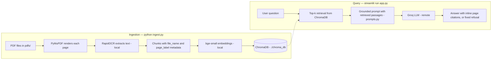

# PDF Study RAG

A local-first RAG (retrieval-augmented generation) app that lets you chat
with your PDF study materials and get answers with page-level citations.

Built with **LlamaIndex** + **ChromaDB** + **Streamlit**. Answers are generated
by **Groq** (`openai/gpt-oss-120b`) and embeddings run locally with
**BAAI/bge-small-en-v1.5** — so the only API key you need is a free Groq key.

Because image-based PDFs have no text layer, ingestion renders each page with
**PyMuPDF** and extracts text with **RapidOCR** (ONNX, fully local — no
Tesseract install needed).

## Features

- Chat UI with conversation history and expandable source excerpts
- Page-level citations (file name, page, relevance score)
- Grounded answers: the model is told to answer only from the retrieved
  passages, to cite them inline as `[file p.N]`, and to reply with a fixed
  sentence (`The notes don't cover this.`) when they don't contain the answer
- Local OCR and embeddings — your PDFs are never uploaded; only the question
  and the retrieved passages are sent to the Groq API (see *Data flow*)
- Rebuildable ChromaDB index; drop in new PDFs and re-run `ingest.py`
- Reproducible retrieval evaluation (`evals/`), run in CI (see *Evaluation*)
- All settings overridable via `.env` (see `.env.example`)

## Data flow

Everything about your documents happens on your machine: PDF rendering, OCR,
chunking, embedding and the ChromaDB index. At query time, **your question
and the top-k retrieved passages (with their file name and page label) are
sent to the Groq API** to generate the answer. Nothing else leaves the
machine, and no document is uploaded in full.

## Architecture



## Setup

```bash
# 1. Create a virtual environment (Python 3.10+ recommended)
python -m venv .venv
source .venv/bin/activate        # Windows: .venv\Scripts\activate

# 2. Install dependencies (pinned in requirements.txt)
pip install -r requirements.txt

# 3. Add your Groq API key
cp .env.example .env             # then edit .env and paste your key
# Get a free key at https://console.groq.com
```

## Usage

```bash
# 1. Put your PDFs into the pdfs/ folder

# 2. Ingest them into the vector database (OCR — takes a few minutes)
python ingest.py

# 3. Run the app
streamlit run app.py
```

Then open http://localhost:8501 and ask questions about your documents.
Each answer cites the passages it used and comes with an expandable view of
the source excerpts. If nothing relevant is found, the app says
*The notes don't cover this.* and shows the closest passages separately,
clearly marked as not used. `TOP_K` (default 3) controls how many passages
are retrieved per question.

## Docker

```bash
docker build -t pdf-study-rag .
docker run -p 8501:8501 --env-file .env \
  -v ./pdfs:/app/pdfs -v ./chroma_db:/app/chroma_db \
  pdf-study-rag
```

Run ingestion inside the container first if `chroma_db` doesn't exist:

```bash
docker run --rm -v ./pdfs:/app/pdfs -v ./chroma_db:/app/chroma_db \
  pdf-study-rag python ingest.py
```

## How it works

| Step | Tool |
|---|---|
| PDF → images | PyMuPDF (~144 DPI render) |
| Images → text | RapidOCR (ONNX runtime, local) |
| Text → vectors | HuggingFace `bge-small-en-v1.5` (local) |
| Vector store | ChromaDB (`./chroma_db`) |
| Retrieval | top-k similarity (`TOP_K`, default 3) |
| Prompting | grounded QA + refine templates (`prompts.py`) |
| Q&A LLM | Groq `openai/gpt-oss-120b` |
| UI | Streamlit chat |

Re-running `python ingest.py` rebuilds the collection from scratch. Chunking
(1024 tokens, 128 overlap) is set in `ingest.py`; the evaluation below is the
regression guard for changing it.

## Project layout

```
├── app.py             # Streamlit chat app (thin UI over rag.py)
├── ingest.py          # OCR + embedding pipeline → ChromaDB (build_index)
├── rag.py             # Open the index, build retriever / grounded query engine
├── prompts.py         # Grounded QA and refine prompt text, refusal sentence
├── config.py          # Shared settings, overridable via .env
├── utils.py           # Pure helpers (unit-tested)
├── tests/             # pytest suite (test_eval.py is opt-in, see below)
├── evals/             # Fixture text, generator, questions, eval runner
├── requirements.txt   # Pinned runtime dependencies
├── requirements-dev.txt
├── pyproject.toml     # Ruff + pytest config
├── Dockerfile
├── .env.example       # copy to .env and add GROQ_API_KEY
└── pdfs/              # drop your PDFs here (not committed to git)
```

## Evaluation

`evals/` is a small, reproducible check that the pipeline retrieves the right
page — the thing citations depend on.

- `evals/fixture_text.py` — seven pages of original study notes (linear
  algebra and probability). Each page contains facts found on no other page,
  so every question has exactly one correct page.
- `evals/make_fixture.py` — renders those pages to `sample_notes.pdf` with
  PyMuPDF. The PDF is generated on demand and never committed, so the
  repository contains no course material.
- `evals/questions.json` — 12 questions with the page that answers each,
  plus 3 questions the notes do not cover.
- `evals/run_eval.py` — builds a throwaway index from the fixture with the
  real ingestion code (`ingest.build_index`), reopens it the way the app does
  (`rag.load_index`) and retrieves for every question.

Retrieval metrics — offline, no API key needed: **hit@1** and **hit@3** (is
the expected page the first / among the first three unique pages retrieved)
and **MRR**. When `GROQ_API_KEY` is set, the script also asks the grounded
query engine every question and reports how often in-scope answers cite the
expected page inline and how often out-of-scope questions get the fixed
refusal sentence.

```bash
python -m evals.run_eval              # retrieval, plus answer checks if a key is set
python -m evals.run_eval --no-llm     # retrieval only
pytest -m eval tests/test_eval.py -v -s   # the retrieval run as a gated test
```

Results are written to `evals/results.json` (gitignored). The test fails when
hit@3 drops below `EVAL_MIN_HIT3` (default `0.7`), and CI runs it in a
separate `eval` job that uploads `results.json` as an artifact. The fixture
is deliberately small: treat the numbers as a regression guard for chunking,
embedding-model and prompt changes, not as a benchmark.

## Development

```bash
pip install -r requirements-dev.txt
ruff check .                        # lint
pytest tests/ -v                    # unit tests (eval excluded by default)
pytest -m eval tests/test_eval.py -v -s   # full-pipeline retrieval eval
```

CI runs the same checks on every push (`.github/workflows/ci.yml`): a fast
`lint` job (Ruff, compile check, unit tests) and the `eval` job above.

## Limitations and next steps

- **OCR errors propagate.** Every page is OCR'd, even born-digital ones, so
  a misread word is a misread word at retrieval time. Raising `RENDER_SCALE`
  helps with small text; a text-layer-first path would help more.
- **Grounding is prompted, not enforced.** The sources listed under an answer
  are the passages that were retrieved; the inline `[file p.N]` citations are
  written by the model. The answer checks in `evals/run_eval.py` measure
  whether those citations point at the expected page and whether out-of-scope
  questions are refused, but they need a Groq key and are not gated in CI.
- **The eval fixture is synthetic.** Seven clean pages are a regression guard,
  not a measure of quality on real lecture notes; a golden question set over
  actual study material would be the next step.
- **Single-user, no auth.** The Streamlit app is meant to run on your own
  machine; the ChromaDB index is rebuilt from scratch on every ingest.

## Notes

- `pdfs/`, `chroma_db/`, `.env`, and `.venv/` are gitignored — your documents
  and API key are never committed. See *Data flow* for what is sent to the
  Groq API at query time.
- OCR quality depends on the source images; if results look poor, set
  `RENDER_SCALE=3` in `.env` and re-run `python ingest.py`.
- If answers miss context that is in your notes, try `TOP_K=5` in `.env`;
  the sidebar shows the value in use.
- The pipeline renders and OCRs every page, so it handles scanned/image
  PDFs and born-digital PDFs alike.

## License

MIT — see [LICENSE](LICENSE).
