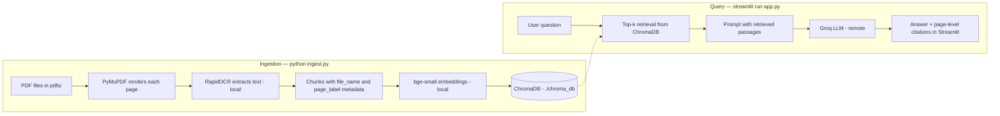

# PDF Study RAG

A local-first RAG (retrieval-augmented generation) app that lets you chat
with your PDF study materials and get answers with page-level citations.

Built with **LlamaIndex** + **ChromaDB** + **Streamlit**. Answers are generated
by **Groq** (`openai/gpt-oss-120b`) and embeddings run locally with
**BAAI/bge-small-en-v1.5** — so the only API key you need is a free Groq key.

Because image-based PDFs have no text layer, ingestion renders each page with
**PyMuPDF** and extracts text with **RapidOCR** (ONNX, fully local — no
Tesseract install needed).

## Features

- Chat UI with conversation history and expandable source excerpts
- Page-level citations (file name, page, relevance score)
- Local OCR and embeddings — your PDFs are never uploaded; only the question
  and the retrieved passages are sent to the Groq API (see *Data flow*)
- Rebuildable ChromaDB index; drop in new PDFs and re-run `ingest.py`
- All settings overridable via `.env` (see `.env.example`)

## Data flow

Everything about your documents happens on your machine: PDF rendering, OCR,
chunking, embedding and the ChromaDB index. At query time, **your question
and the top-k retrieved passages (with their file name and page label) are
sent to the Groq API** to generate the answer. Nothing else leaves the
machine, and no document is uploaded in full.

## Architecture



## Setup

```bash
# 1. Create a virtual environment (Python 3.10+ recommended)
python -m venv .venv
source .venv/bin/activate        # Windows: .venv\Scripts\activate

# 2. Install dependencies (pinned in requirements.txt)
pip install -r requirements.txt

# 3. Add your Groq API key
cp .env.example .env             # then edit .env and paste your key
# Get a free key at https://console.groq.com
```

## Usage

```bash
# 1. Put your PDFs into the pdfs/ folder

# 2. Ingest them into the vector database (OCR — takes a few minutes)
python ingest.py

# 3. Run the app
streamlit run app.py
```

Then open http://localhost:8501 and ask questions about your documents.
Each answer includes citations and an expandable view of the source excerpts.

## Docker

```bash
docker build -t pdf-study-rag .
docker run -p 8501:8501 --env-file .env \
  -v ./pdfs:/app/pdfs -v ./chroma_db:/app/chroma_db \
  pdf-study-rag
```

Run ingestion inside the container first if `chroma_db` doesn't exist:

```bash
docker run --rm -v ./pdfs:/app/pdfs -v ./chroma_db:/app/chroma_db \
  pdf-study-rag python ingest.py
```

## How it works

| Step | Tool |
|---|---|
| PDF → images | PyMuPDF (~144 DPI render) |
| Images → text | RapidOCR (ONNX runtime, local) |
| Text → vectors | HuggingFace `bge-small-en-v1.5` (local) |
| Vector store | ChromaDB (`./chroma_db`) |
| Q&A LLM | Groq `openai/gpt-oss-120b` |
| UI | Streamlit chat |

Re-running `python ingest.py` rebuilds the collection from scratch.

## Project layout

```
├── app.py             # Streamlit chat app with citations
├── ingest.py          # OCR + embedding pipeline → ChromaDB
├── config.py          # Shared settings, overridable via .env
├── utils.py           # Pure helpers (unit-tested)
├── tests/             # pytest suite
├── requirements.txt   # Pinned runtime dependencies
├── requirements-dev.txt
├── pyproject.toml     # Ruff lint config
├── Dockerfile
├── .env.example       # copy to .env and add GROQ_API_KEY
└── pdfs/              # drop your PDFs here (not committed to git)
```

## Development

```bash
pip install -r requirements-dev.txt
ruff check .                        # lint
pytest tests/ -v                    # tests
```

CI runs the same checks on every push (`.github/workflows/ci.yml`).

## Limitations and next steps

- **OCR errors propagate.** Every page is OCR'd, even born-digital ones, so
  a misread word is a misread word at retrieval time. Raising `RENDER_SCALE`
  helps with small text; a text-layer-first path would help more.
- **Citations are retrieval-derived.** The sources shown under an answer are
  the passages that were retrieved and given to the model; how faithfully the
  answer sticks to them is not yet measured.
- **No answer-quality evaluation yet.** There is no golden question set, so
  "good retrieval" is currently a judgement rather than a number.
- **Single-user, no auth.** The Streamlit app is meant to run on your own
  machine; the ChromaDB index is rebuilt from scratch on every ingest.

## Notes

- `pdfs/`, `chroma_db/`, `.env`, and `.venv/` are gitignored — your documents
  and API key are never committed. See *Data flow* for what is sent to the
  Groq API at query time.
- OCR quality depends on the source images; if results look poor, set
  `RENDER_SCALE=3` in `.env` and re-run `python ingest.py`.
- The pipeline renders and OCRs every page, so it handles scanned/image
  PDFs and born-digital PDFs alike.

## License

MIT — see [LICENSE](LICENSE).
